<div align="center">


# Case Diary

**The hearing diary that remembers every bench, every adjournment and every promise, across years and across cases.**

A memory agent for Indian litigation lawyers, built on [Hindsight](https://hindsight.vectorize.io).

<p>


</p>

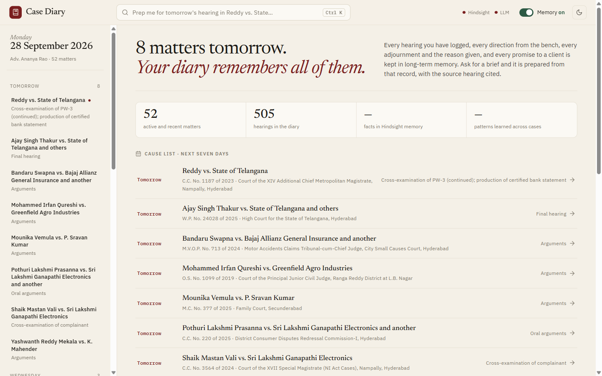

</div>

## Why this exists

India has over **5 crore pending cases**. A criminal trial before a Hyderabad magistrate easily runs four years and fifteen hearings, most of them adjourned. A mid-level advocate carries 80 to 200 live matters, and the only memory of each is a paper diary.

The night before a hearing, what the advocate needs is not legal research. It is recall:

- what happened last time, and what the judge asked for
- which documents are still pending, and from whom
- what they promised the client
- which facts have **changed** since they were first recorded
- how this judge runs the court, and how this opposite counsel behaves **in every other matter**

A stateless model can't answer any of that, however clever it is. It has never seen the hearings.

<div align="center">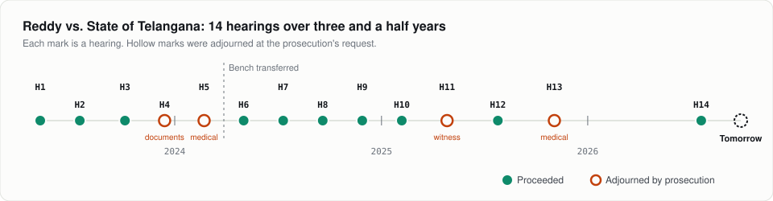</div>

## One request

> **"Prep me for tomorrow's hearing in Reddy vs. State."**

Case Diary recalls the matter's 14 hearings from Hindsight, looks across every other matter before the same bench and against the same prosecutor, and writes a brief in which **every line cites the hearing it came from**.

<div align="center">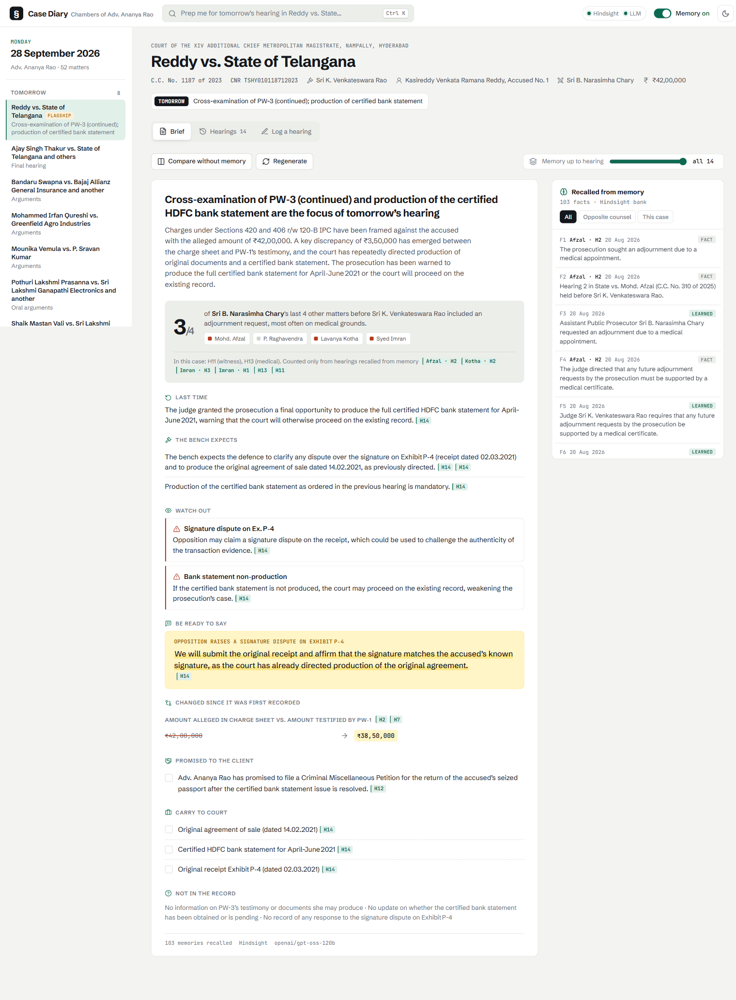</div>

| In the brief | Where it came from |
|---|---|
| The prosecution has a **last chance** to produce the certified HDFC statement | H14 |
| Keep any written note **under five pages**; this judge refused 44 pages | H12 |
| APP Chary sought time in **3 of his last 4 matters** before this bench, mostly on medical grounds | four *other* cases |
| The amount moved from **₹42,00,000** in the charge to **₹38,50,000** in PW-1's evidence | H2 → H7 |
| The passport petition promised to the client is **still open** | H9, H12, H14 |

That third row is the one a paper diary can't produce. It comes from other files, and only memory connects them:

<div align="center">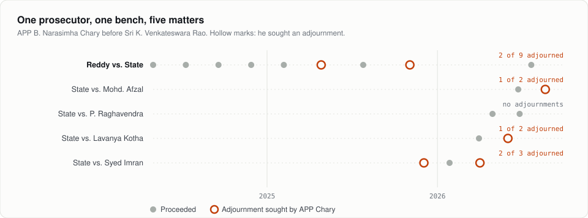</div>

### Without memory, side by side

**Compare without memory** puts a stateless assistant next to Case Diary on the same request. On the left: generic advice on cross-examination. On the right: this case.

<div align="center">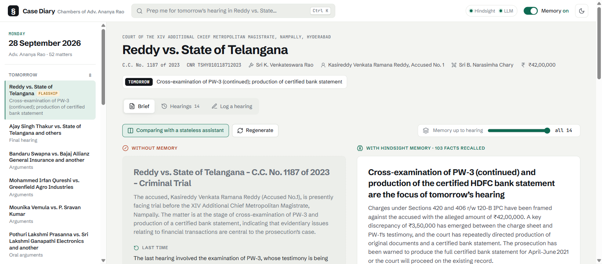</div>

## How it works

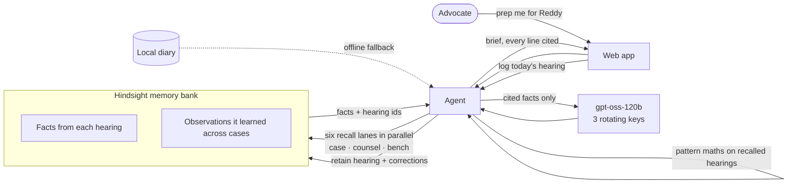

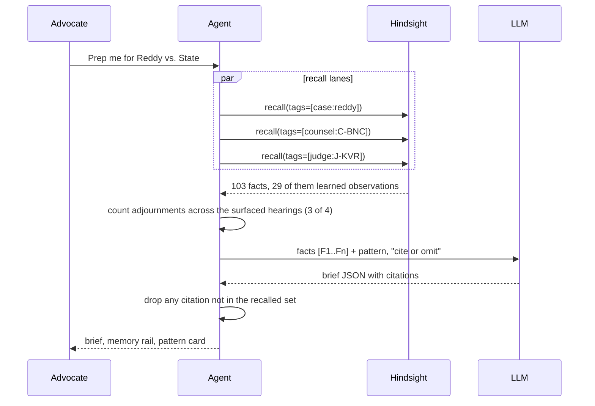

## How Hindsight memory is used

Memory is the product. The brief is written **only** from what Hindsight recalls. The local diary exists to feed memory and to cover for it when it's unreachable.

| Hindsight feature | What Case Diary does with it |
|---|---|
| **`retain`** with `document_id`, `timestamp`, `tags`, `metadata` | Every hearing becomes a dated memory tagged `case:`, `judge:`, `counsel:` and `court:`. The hearing id is the `document_id`, so re-seeding is idempotent. |
| **Bank missions** (`mission`, `retain_mission`, `observations_mission`) | Tell Hindsight what matters in a court note (adjournment grounds, directions, rupee figures, witness status, client promises) and to consolidate *behaviour* of judges and counsel. |
| **`recall`** with tag scoping | Six parallel lanes: this case (history, directions, promises), this counsel in all matters, this bench in all matters. |
| **Observations** | Patterns Hindsight formed by itself. They're marked **learned** in the memory rail and power the Bench & Bar profiles. |
| **Directives** | A hard rule on the bank: state only what's in memory, cite the hearing, never predict outcomes. |
| **Temporal facts** | Newer facts win conflicts, and the **memory depth** slider rewinds the brief to any earlier hearing. |

### It gets better as the diary grows

Drag **Memory up to hearing** back to H3 and the brief is thin. By H7 the amount discrepancy is in, and by H14 the bench's habits and the counsel pattern are too. Each **Log a hearing** adds to it.

<div align="center">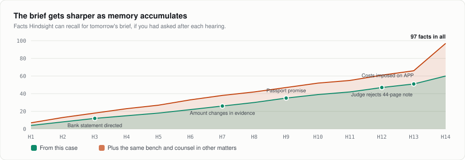</div>

### Facts change, and the diary says so

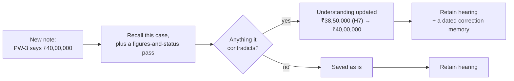

The old fact isn't erased. It's **superseded** by a newer, dated memory ("as of H15, X is now Y; this supersedes Z recorded at H7"), which is how a lawyer treats a record. The sample note on the Reddy case catches four changes: the amount, the bank statement moving from pending to produced, PW-3's cross concluding, and the passport petition's new timeline.

<table>
<tr>
<td width="50%">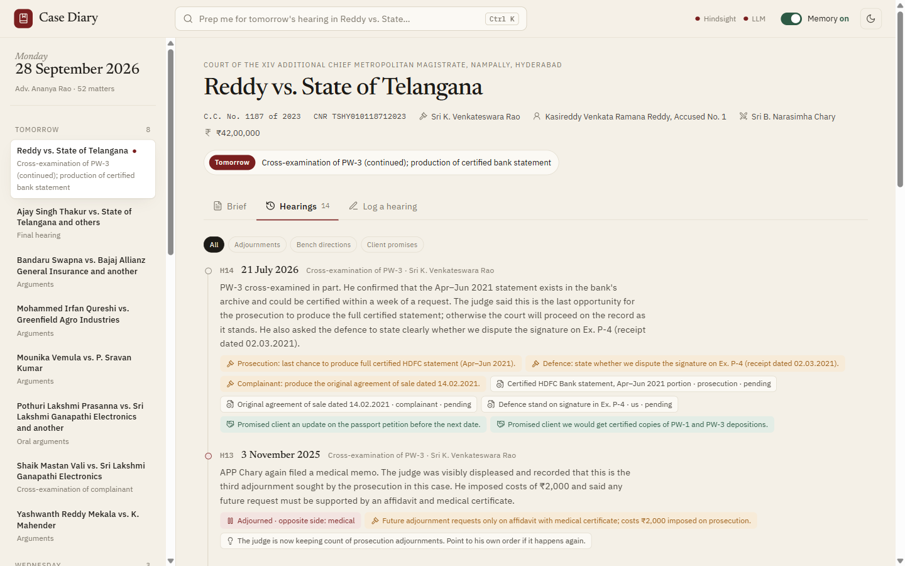</td>
<td width="50%">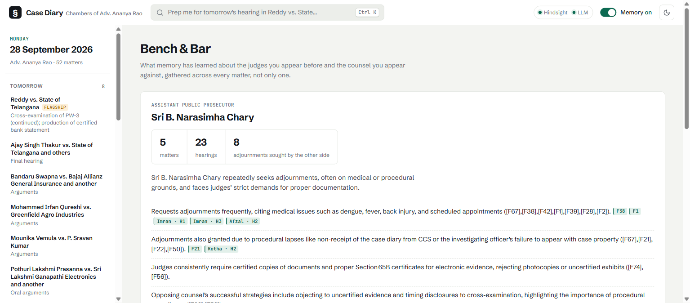</td>
</tr>
<tr>
<td align="center"><sub>Every hearing, with directions, documents and promises</sub></td>
<td align="center"><sub>Bench & Bar: what memory learned about a counsel across matters</sub></td>
</tr>
</table>

## When things go wrong

At 11 pm before a hearing, a stack trace is no use to anyone. Every dependency has a planned failure mode.

| If this fails | The advocate sees | Because |
|---|---|---|
| **Hindsight unreachable** | The brief, with an amber *"answered from the local diary"* note | Recall falls back to the diary, split into sentence-level facts. A 20-second circuit breaker stops each request from waiting on a timeout. |
| **Hindsight down while saving** | *"Saved · 2 queued, will sync automatically"* | The note is kept locally and queued. The health check replays the queue when memory returns. |
| **Groq rate limit** | Nothing | Up to three keys rotate round-robin. A limited key rests exactly as long as Groq's `retry-after` says while the others serve. Then the call tries the fallback model. |
| **Model returns junk or empty JSON** | Nothing | Tolerant parsing, a strict re-ask, and reasoning effort set so `gpt-oss` doesn't spend its whole budget thinking. |
| **No model available at all** | Recalled facts under the same headings, with a note | A template composer that invents nothing. |
| **Model cites a fact that doesn't exist** | The claim is dropped | Every citation is checked against the recalled fact ids. Stray inline ids are pulled out of the prose. |
| **"Prep me for Sharma"** | *"Which matter did you mean?"* | Fuzzy matching with a confidence threshold. |
| **Seeding stops halfway** | Run it again | Progress is checkpointed per batch. |
| **Demo on another day** | "Tomorrow" is still tomorrow | Dates are anchored and shifted on first run. |

`python -m pytest` exercises these paths with **no Hindsight and no API key**.

## The data

Synthetic, and written to read like a real Hyderabad practice.

- **52 matters · 505 hearings · 246 adjournments** across 11 real forums: Nampally criminal courts, the Telangana High Court, City Civil Court, the MACT, the District Consumer Commission, the Family Court at Secunderabad, the ACB Special Court and the Labour Court.
- Real procedure: IPC 420/406/120-B, Section 138 NI Act, Section 65B certificates, Section 125 CrPC, GHMC demolition notices, M.V.O.P. claims.
- Real-looking particulars: CNR and crime numbers, cheque numbers and bank branches, survey numbers in Bachupally and Shamshabad, vehicle registrations (TS 09 EX 4417, Tata Ace Gold), a seized Samsung Galaxy S21 FE (SM-G990E), a Hikvision DS-7208HGHI-K1 DVR in an ACB trap case, and consumer goods by model number (Daikin FTKF50TV16U, Samsung WW80T504DAW).
- 13 judges and 12 opposite counsel with consistent **habits**, so patterns genuinely emerge across files.
- One hand-written flagship matter, *Reddy vs. State of Telangana*, with planted threads: a certified statement that never arrives, a defective 65B certificate, a figure that shifts between charge and evidence, a bench transfer, and open client promises.

`python scripts/generate_data.py` rebuilds it deterministically. `python scripts/make_charts.py` redraws the figures above.

## Run it

> [!NOTE]
> Two keys: **Hindsight** (the memory) and **Groq** (the model that writes briefs). Both have free tiers.

**1. Install**

```bash
pip install -r requirements.txt
cp .env.example .env
```

**2. Hindsight.** Either option works.

<details open>
<summary><b>Hindsight Cloud</b> (recommended)</summary>

1. Sign up at [ui.hindsight.vectorize.io](https://ui.hindsight.vectorize.io), then apply promo code `MEMHACK99` under **Billing**.
2. **Connect → Create API Key**, and copy it (it's shown once).
3. In `.env`: `HINDSIGHT_URL=https://api.hindsight.vectorize.io` and `HINDSIGHT_API_KEY=<key>`.
</details>

<details>
<summary><b>Local Docker</b></summary>

Set `HINDSIGHT_URL=http://localhost:8888`, leave `HINDSIGHT_API_KEY` empty, put a Groq key in `HINDSIGHT_API_LLM_API_KEY` (Hindsight uses its own model for fact extraction), then run `docker compose up -d`.
</details>

**3. Groq.** Create a key at [console.groq.com/keys](https://console.groq.com/keys) and set `LLM_API_KEY`. The free tier allows about 8k tokens a minute per key, and a brief uses about 5k. For a live demo, add keys from one or two more accounts as `LLM_API_KEY_2` and `LLM_API_KEY_3`, and they'll rotate.

**4. Check, seed, run**

```bash
python scripts/check_setup.py      # tests Hindsight and every key, says exactly what is missing
python scripts/seed_memory.py      # ~150 hearings into Hindsight, about 7 minutes, resumable
python -m uvicorn app.main:app --port 8000
```

Open **http://localhost:8000**.

> [!TIP]
> `seed_memory.py --fresh` wipes the bank and re-anchors dates to today. Run it before a demo if you've been rehearsing **Log a hearing**. `--scope all` loads all 505 hearings.

## Three-minute demo

1. **Docket.** Eight matters tomorrow. Open *Reddy vs. State of Telangana*.
2. **Brief.** Point at the citations, the **3/4** card built from other files, the line ready to say in court, and the figure that changed.
3. **Compare without memory.** The stateless answer beside Case Diary's.
4. **Memory up to hearing.** H3, then H7, then H14.
5. **Log a hearing.** Use the sample note and watch *Understanding updated* catch ₹38,50,000 → ₹40,00,000.
6. **Bench & Bar.** Open APP Chary or Sri K. Venkateswara Rao.
7. **Ctrl K.** *"Which bail arguments have worked before Justice Varma?"*

## Layout

```
app/
  agent.py      brief · ask · log_hearing · profile, recall lanes, pattern maths, fallbacks
  memory.py     Hindsight: bank setup, retain, recall, circuit breaker, per-thread clients
  llm.py        Groq: key rotation, per-key cooldowns, model fallback, tolerant JSON
  diary.py      the advocate's record, rendering hearings into memory, offline recall
  prompts.py    grounding and citation rules
  main.py       FastAPI routes and the static frontend
web/            index.html · styles.css · app.js (no build step)
scripts/        generate_data · seed_memory · check_setup · make_charts
data/           diary.json (52 matters, 505 hearings)
docs/           screenshots and charts used here
tests/          run fully offline
```

## Guard rails

- It never predicts outcomes and never cites case law that isn't in memory.
- Every line of a brief carries a hearing citation. Anything uncited is dropped.
- The advocate decides. Case Diary prepares; it doesn't advise.
- Every person, case and event in the data is fictional. Court names and procedure are real.

## Next

Pull hearings straight from the **eCourts** CNR status API, take voice notes from the court corridor over WhatsApp, share a memory bank across a chamber so juniors inherit the senior's knowledge of every bench, and accept Telugu and Hindi dictation.

<div align="center"><sub>Built for <b>AI Agents That Learn Using Hindsight</b>.</sub></div>
